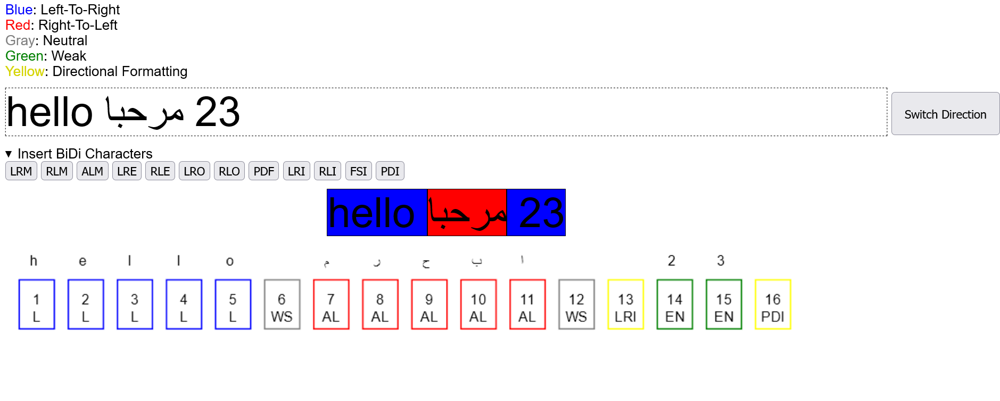

# Demo of Unicode Bidirectional Algorithm

This is a simple JavaScript demo of [Unicode Bidirectional Algorithm](https://en.wikipedia.org/wiki/Bidirectional_text) for handling text containing
characters of mixed directionality (e.g. mixed English and Arabic text).

I wrote this to explore BiDi text and to create simple illustrations for an article
about BiDi text that I intend to write.

## Credit

BiDi support ([bidi.js](bidi.js)) is provided by [bidi-js](https://github.com/lojjic/bidi-js).

## TODO
- [] Short description of BiDi character classes.
- [] Ambitious: Have a go at reading the [standard](https://unicode.org/reports/tr9/) and try to write your own implementation!
